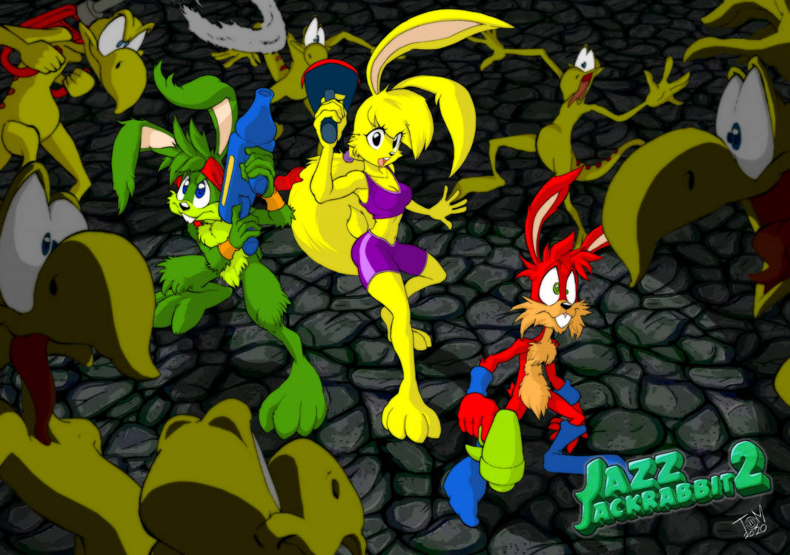
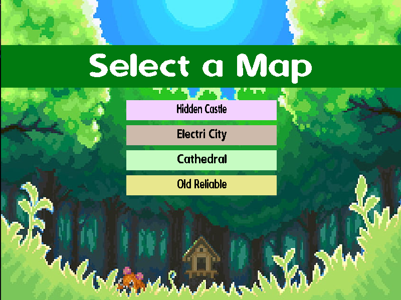
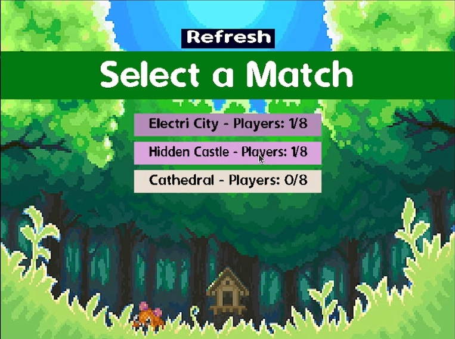
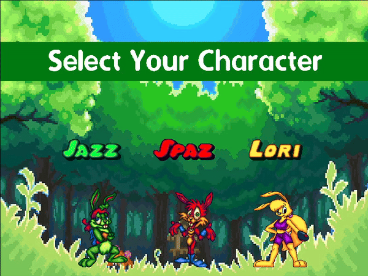
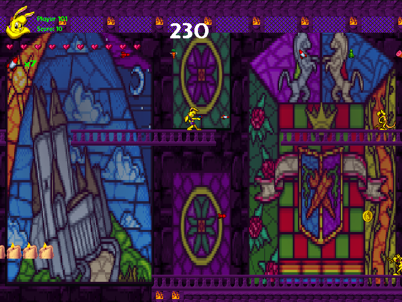

# Jazz Jackrabbit 2 Battle Royale - Fan Remake

**Mira el trailer del juego clickeando la thumbnail!**

**Tambien podes ver la [pagina web](https://atusgames.github.io/#/jazz-jackrabbit-2-remake) de este proyecto!**

## Images

### Map select

Cuando se esta creando una partida se puede elegir el mapa en el que se desa jugar.

### Match select

Cuando se esta entrando a una partida se puede elegir entre todas las partidas abiertas actualmente.

### Character select

Cuando se esta creando o entrando a una partida se puede elegir uno de los tres personajes.

### In-game

Cuando se esta en una partida arriba a la izquierda se puede ver la informacion relevante del estado del personaje, que arma tiene equipada y cuantas balas tiene.

## Como Jugar & Mas Info

- [Manual de usuario](./docs/user_manual.md) (COMO JUGAR!)
- [Manual de projecto](./docs/project_manual.md)
- [Documentacion tecnica](./docs/documentation.md)

## Team

- [Maxo](https://github.com/maxogod)
- [Agus](https://github.com/agustinbarbalase)
- [Sev](https://github.com/SantiSev)
- [Niko](https://github.com/nrsanchezfiuba)

## Licencia

El proyecto cuenta con una licencia [MIT](./LICENSE).

## Derechos Externos

* Podes comprar el juego original [aqui](https://www.gog.com/en/game/jazz_jackrabbit_2_collection).
* Arte tomada de [aqui](https://www.spriters-resource.com/pc_computer/jazzjackrabbit2thesecretfiles/).
* Usamos algunas herramientas con licencia MIT de [este](https://github.com/eldipa) usuario (mas detalles en **project manual**).
