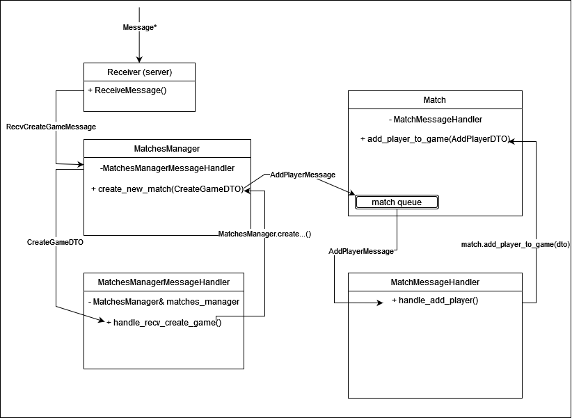
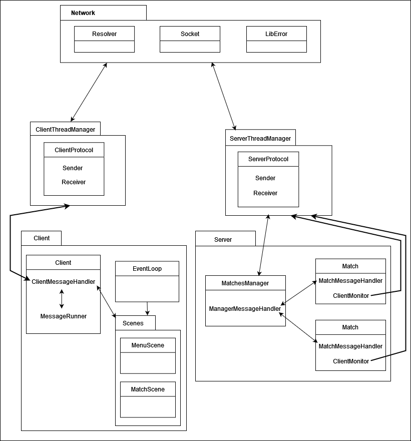

# Documentation

## Indice

El trabajo práctico se divide en cuatro partes principales:

* Game engine
* Client
* Server
* Protocol

## Game engine

### Graphics Engine

La graphics engine se encuentra casi completamente en `/game_engine/gui` pero tambien incluye `/game_engine/controllers` aunque estos ultimos no son graficos en si, sino que son controladores de input de usuario.

#### Controllers

* Keyboard: Este controlador detecta la entrada del teclado abstrayendo los SDL_Events acordes. Cuando detecta input avisa a sus signal objects que ocurrio, estos signal objecs es una lista de CanvasObjects que son los tipos de objetos visibles en la pantalla. Para llenar la lista tiene un metodo para agregar y otro para sacar objetos. Adicionalmente es thread safe.
* Mouse: Similarmente al teclado cumple el mismo proposito con la diferecia que este avisa cuando hay un click y/o un hover.

#### GUI

Se crearon varias clases basicas necesarias en `gui/basic`:

* AssetsManager: para obtener paths absolutos de archivos.
* ResourcePool: para cargar archivos una vez y luego reutilizar una referencia constante a un shared pointer a el archivo en cuestion.
* Font: para abstraer SDL_Font en una clase RAII.
* Texture: para abstraer SDL_Texture en una clase RAII.
* Window: para abstraer SDL_Window en una clase RAII. tambien crea el renderer e inicializa SDL.

La clase padre de los widgets graficos es **CanvasObject**, que tiene metodos basicos virtuales como:

* draw
* on_click
* on_hover
* is_intersecting para puntos o rectangulos
* etc

Se crearon clases de utilidad graficas como:

* AnimatedSprite: Contiene la logica para animar una imagen, y le da uso a la iteracion dada por parametro del draw, la cual viene de el rendering loop y determina cuando se dropean frames y cuando no. (se utiliza tecnica Drop&Rest).
* Sprite: Para imagenes estaticas
* Button: Una clase base para los botones, contienen un rectangulo de color y un label, ambos pueden cambiar color on hover.
* ColorRect: Rectangulo de un color liso.
* Label: Una etiqueta para dibujar texto.

A su vez se creo un objecto especial que no grafico ni controlador:

* Camara: Contiene logica para solo renderizar los objetos que estan en la pantalla de 800x600 (utilizada por el editor y el match scene).

### Physics Engine
Para el diseño de la _"physics engine"_, decidi basarme en la implementacion de fisicas del motor de juegos **Godot** donde llegue al siguiente planteo

##### Collision Objects
Todos los objects del juego son `CollisionObject`'s que consiste en objects con 
```cpp
int hitbox_width;   // el ancho del hitbox del object0 
int hitbox_height;  // el alto del hitbox del objecto 
bool is_active = true; //el status para indicar si debe seguir detectando collisiones o no
```
[ un hitbox es utilizado para detectar colisiones entre los objetos de un juego ]

Para detectar dichas collisiones se utiliza los metodos protegidos `is_touching()` que tiene 2 variantes:
```cpp
    /*
     * This code determines which face of the calling
     * CollisionObject instance (i.e., *this or self)
     * is being touched by the other collision object.
     */
    CollisionFace is_touching(const CollisionObject* other) const;

    /*
     * This code is identical to the is_touching method,
     * but it returns a boolean value instead of a CollisionFace.
     */
    bool is_touching_bool(const CollisionObject* other) const;
```
`CollisionFace` es un enum que indica de que lado fue tocado mi objecto con respecto al otro. Esto es util para diferenciar collisiones entre paredes, suelos, etc
Hay objectos (como en balas e items) donde no es importante saber donde fue tocado sino que solo importa que haya ocurrido una colision.

#### Abstraccion de Collision Object

 ```cpp
virtual void handle_colision(CollisionObject* other) = 0;
```
Este metodo es virtual puro porque CollisionObject no se debe poder instanciar en cualquier momento, el CollisionObject es la clase padre de todos los componentes del juego en donde todos sus clases hijos deben _handelear_ sus colisiones (dar la logica e indicar que ocurre cuando son colisionados). Hasta el momento hay solo 2 tipos:
- `Dynamic_body`
- `Static_body`

#### Collision Objects - Static Body
Static Body consiste en objetos que no se registra su movimiento y tampoco son movidos ó desaparecen.

#### Collision Objects - Dynamic Body
Dynamic Body consiste en objects que tienen movimiento (tanto horizontal como vertical), por lo tanto tienen el atributo:
```cpp 
Vector2D velocity;
```
Como los dynamic bodies se mueven, se debe poder actualizar sus valores de posicion y/o velocidad, por lo tanto, tambien tienen una funcion virtual llamada:
```cpp
virtual void update_body();
```
Cuando se desee crear un objecto que se puede mover se debe implementar esta funcion sino nunca se actualizará sus valores de posicion / movimiento


### Collision Manager
Como vimos hasta el momento, todo es un CollisionObject, todo debe tener collisiones, etc. Pero aca viene la parte interesante ...

**¿Como se _detectan_ las colisiones?** --> A traves del `CollisionManager` !

El CollisionManager tiene como funcion recibir CollisionObjects, colocarlo en una grilla (luego explico como es la grilla) y activar los metodos de handle_collision cuando detecta una collision entre 2 objectos.

Principalmente detecta las colisiones de todos los objectos dinamicos. Si fuese a detectar cada colision de cada objeto, esto haria que el engine funcione muy pobre, por lo tanto decidí solo _trackear_ las colisiones de dynamicBodies y los StaticBodies solo estarán ahi para ser detectados.

#### Collision Manager - Grid & Deteccion de Collisiones
La grilla del collisionManager es de la siguiente manera:
```cpp
std::vector<std::vector<std::shared_ptr<CollisionObject>>> grid;
```

Es una matriz de shared pointers de CollisionObjects, en donde cada celda de la grilla indica 
un pixel del juego. Al colocar un objecto en la grilla, en realidad estamos colocando en las posiciones desde (x ,y ) hasta (x+w , x+h ) shared pointers al mismo collision Object

Luego el CollisionManager realiza detecciones de los objetos dynamicos iterando alrededor de sus celdas y viendo si da nullpointer (no se detecto un objecto) o un shared pointer de otro CollisionObject (tanto statico o dynamico). Al detectar una collision realiza un **double dispatch** donde se llama los metodos de handeleo de collisiones de ambos objectos detectas.

#### Collision Manager - Detectar muchisimos bodies

Para nuestro juego, vamos a tener personajes (dynamic bodies) que disparan desde sus armas distintas bullets (tambien dynamic bodies), pero ... ¿El collision Manager no se va a realentizar al traquear tantos objetos? NO

con el metodo: 
```cpp
 void remove_inactive_bodies();
```
el collisionManager se ocupara de deshacerse de todos los bodies marcados como inactivos y serán quitadas del collisionManager.

#### Collision Manager - Usos

Se utiliza como atributo en la clase `Match` que lo utiliza para:
- Cargar las colisiones de plataformas del mapa de una partida
- Traquear los movimientos de players, enemigos, items & balas en la partida 

Al cargar un mapa, se debe utilizar las funciones 
```cpp
void add_object(std::shared_ptr<StaticBody> obj);

void prepare_map();
```
`add_object` permite agregar objectos estaticos al collisionManager y luego, la funcion `prepare_map` realiza una limpeza de las collisiones desactivando collisiones inecesarias entre objectos para evitar problemas de paredes invisibles y problemas raras debido a como se creo el custom map.

Al insertar un player/enemy/item a la partida ó respawnearlo, se debe avisar al collisionManager con la funcion: 
```cpp
void track_dynamic_body(std::shared_ptr<DynamicBody> obj);
```

## Client

### Escenas

Se dividio el cliente en 3 Scenes fundamentales:

* MenuScene
* MatchScene
* EditorScene

La escena de menu scene tambien incluye 3 escenas mas, para sus diferentes funcionalidades, estas son:

* Map select scene: usada para seleccionar un mapa al crear una partida.
* Match select scene: usada para seleccionar una partida al querer unirse a alguna.
* Character select scene: usada en Create Match y en Join Match. Permite seleccionar uno de los 3 personajes para jugar.

La escena de match scene al terminar deriva a otra escena de **ScoreBoard** la cual muesta el top 3 jugadores con mas puntos al finalizar.

### Componentes

A lo largo de las escenas se usan muchas componentes distintas, entre ellas:

#### Menu objects

* CreateMatchButton
* JoinMatchButton
* EditorButton
* QuitButton
* CharacterSelector
* MapSelector
* MatchSelector
* ReceiveMatchesButton

#### Editor objects

* EditorController
* EditorTile
* TileSelector
* TileManager
* SaveExitEditorButton

#### GameObjects

* PlayerController
* Map
* Players (todas las animaciones de los 3 conejos)
* Enemies (las animaciones de los 2 conejos)
* Items (las animaciones de los items coleccionables)
* Bullets (los sprites de las balas que son disparadas)

#### Hud

* EditorHud: hud de donde se seleccionan los tiles pincel para editar
* IngameHud: hud para mostrar informacion del personaje en la partida (vida, arma seleccionada y municion, score, nombre y personaje)

#### Iconos

Hay una variedad de iconos que son sprites estaticos como, la imagen del personaje, la imagen estatica de las balas para mostrar en el HUD y la barra de vida con sus corazones.

### EventLoop

* El manejo de user input es responsabilidad de un thread aparte que updatea al keyboard y mouse para que estos avisen a sus signal objects.

* El manejo de los mensajes que llegan del servidor no se hace en el mismo thread y este se llama **MessageRunner**

## Server

### Game Logic
Consiste en toda la logica relacionado con el juego en si, personajes, items, cheats, logica de las partidas, etc ...

#### Game Logic - Componentes

Para nuestra logica de juego, con el uso de lo creado en Physics_Engine logramos crear varios tipos de componentes de juego, a continuacion explicaremos brevemente cada uno y como funciona

**Characters**
Para el juego, decidimos crear 2 tipos de characteres, `Players` & `Enemies`

Los Players son los jugadores de las partidas y los clientes pueden ejecutar distitnos tipos de acciones como mover izquierda/derecha, saltar ó disparar

Luego, tenemos los Enemies, que consta de characteres que van a tratar de atacar players que detecten, su movimiento es limitado (solo pudiendo mover izquiera o derecha) y caminan por determinado rango de de espacio

la clases Player & Enemy son clases padre para luego poder crear los distintos tipos de players y enemies.

**Tipos de Players:**
- Jazz
- Spaz
- Lori

**Tipos de Enemies:**
- Mad Hatter 
- Lizard Goon 

**Weapons**

Todos los Jugadores tienen 4 tipos de armas, donde cada uno tiene distitnos tipos de daño, velocidad, frecuencia de disparo y cantidad de ammunicion maxima (con excepcion de una arma que tiene ammo infinita)

Al disparar distitnos player o enemigos, el player recibirá puntos y si logra matar a un enemigo o player recibe puntos bonus.

**Collectables**

Los collecatables son los items del juego, constan de estos tipos:

**Ammo:**

Items que recargan la ammunicion de las armas, de esta clase, hay 3 clases hijos que representan distitnos tipos de Ammo de Armas
- AmmoGunOne
- AmmoGunTwo
- AmmoGunThree

**Health_items:**

Items que recuperan vida de los players, hasta el momento solo tenemos el item:
-  Meat

**Treasure:**

Items que da puntos al jugador que lo collecciona
item:
- Coin

**LA ZANAHORIA**

La zanahoria es un item _raro_ que no cae bajo una categoria en particular que hace lo siguiente.
Cuando un player lo colecciona, tiene 1/2 chance de ser intoxicado o tener invincibilidad por cierta cantidad de tiempo

- Al ser intoxicado, el jugador se moverá mas lento, no podrá saltar ni tampoco va a poder disparar.
- AL ser invincible al ser atacado por algun enemigo, player, etc no recibirá daño


**Platform**
El unico Platform hasta el momento, es el `Box_Platform` que consiste en bloques con Collision.


### GameLoop

El MatchesManager al recibir un mensaje del cliente de crear partida, lanza el hilo Match que es el game loop en sí, y añade al jugador a la partida. La Match puede continuar incluso si se van todos los jugadores, y pueden conectarse en cualquier momento cualquier jugador hasta que termine. La partida solo finaliza al llegar a cero el contador de partida, y tiene como límite una cantidad de jugadores que pueden unirse determinado por la configuracion del juego asignada en config.yaml.
Está configurada la partida para correr el juego a 60 fps, y se manda un estado de la partida por loop al cliente para poder renderizarla.
La partida además de los jugadores que pueden realizarse daño entre sí, contiene enemigos que patrullan de un lado a otro y realizan daño si haces contacto con ellos, aplicando también un knockback. Si los matas consigues puntos al igual que matar otro jugador (tambien puede configurarse estos valores en el confi.yaml).

El hilo principal main lanza la clase `Server`, luego Server lanza el hilo accepter, el aceptador de conexiones con los clientes por socket, y luego `Server` queda a la espera del input 'q' para cerrar todo gracefully.

El accepter lanza el hilo `MatchesManager`, y queda a la espera constante de clientes para ser aceptados. Al aceptar el socket del cliente se lo pasa al `MatchesManager` y a partir de él crea un nuevo "cliente". 

Se crea un `ServerThreadManager` por cada cliente aceptado, el cual tiene su ServerProtocol (utiliza también metodos de su clase padre `CommonProtocol`), y sus respectivos hilos de Sender y receiver para enviar y recibir mensajes.

La lógica principal de `MatchesManager` es de intermediar entre las request del cliente, tanto en estado de "lobby" esperando para crear o unirse a una partida. Va a tener una lista de partidas y una lista de `ClientMonitors`, cada uno para cada partida, para hacer broadcast de los estados del juego o su finalizacion.

La comunicación entre `MatchesManager` y sus `Match` es mayormente entre colas internas, manejadas por dos manejadores de mensajes: `ManagerMessageHandler` quien recibe todo del cliente y realiza las operaciones y respuestas necesarias al cliente, y las acciones y cheats del jugador las comunica internamente buscando la queue de su respectiva `Match` y pusheando el mensaje necesario; y el `MatchMessageHandler` se encarga de igual manera que a cada jugador realizar las acciones o operaciones indicadas por el mensaje del cliente.

La forma de saber qué cliente corresponde a cada player y su partida es que se le asigna un id de cliente cuando se conecta y se lo envía a su cliente para que lo almacene y en cada mensaje especifique su id junto con el mensaje. Y dentro de la partida va a tener su id asociado al cliente.

La desconexión del cliente resulta tanto en el "lobby", que primero le avisa a su partida en la que se encontraba y lo elimina de la partida al "player", y luego elimina la conexión con el protocolo del cliente del servidor y borra su referencia de `ServerThreadManager`.

Ejemplo de creación de partida una vez enviado el mensaje desde cliente:



### GameLoop

El `MatchesManager` al recibir un mensaje del cliente de crear partida, lanza el hilo Match que es el game loop en sí, y añade al jugador a la partida. La `Match` puede continuar incluso si se van todos los jugadores, y pueden conectarse en cualquier momento cualquier jugador hasta que termine. La partida solo finaliza al llegar a cero el contador de partida, y tiene como límite una cantidad de jugadores que pueden unirse determinado por la configuracion del juego asignada en config.yaml.

Está configurada la partida para correr el juego a 60 fps, y se manda un estado de la partida por loop al cliente para poder renderizarla.

La partida además de los jugadores que pueden realizarse daño entre sí, contiene enemigos que patrullan de un lado a otro y realizan daño si haces contacto con ellos, aplicando también un knockback. Si los matas consigues puntos al igual que matar otro jugador (tambien puede configurarse estos valores en el confi.yaml).

## Protocol

El diseño del protocolo fue basado gracias a la clase y diapositiva de la clase de Protocolo de la materia Taller
de Programacion (Veiga).

### Diseño basico del envio y recepcion de mensajes


### Envio de mensajes

La secuencia de pasos para enviar un mensajes, ya se de cliente a servidor o viceversa. Es la siguiente:

1. Se pusheea el mensaje que se quiere enviar a la cola, el constructor de mensaje recibe la informacion que va a mandar
2. El Sender popea el mensaje, y llama a la funcion `send_message` del protocolo y le pasa por parametro el mensaje que
recibe
3. La funcion `send_message` recibe el mensaje y este llama a una funcion `send_message` que le pasa el protocolo
4. La funcion `send_message` del mensaje llama a la funcion que envia el mensaje y le pasa la informacion del mensaje
5. Dentro de la funcion que envia el mensaje, se prepara el mensaje (Endianness) y lo envia

### Recepcion de mensajes

La secuencia de pasos para recibir un mensajes, ya se de cliente a servidor o viceversa. Es la siguiente:

1. El reciver llama a la funcion `recv_message` del protocolo
2. Dentro de esa funcion, se hace un `recv_two_bytes` (Funcion interna del protocolo). Esto corresponde al
_header_ del mensaje
3. Con ese _header_, se determina que mensaje llego. Una vez determinado el mensaje, se llama a una funcion
del protocolo para recibir ese mensaje.
4. Una vez recibido el mensaje, se devuelve
5. Al devolver el mensaje, el reciver pushea el mensaje a la cola

Data Flow:



### Mensajes

Los mensajes del protocolo tiene dos partes:

* Header: Permite distinguir los mensajes
* DTOs: Contiene la información del mensaje

### Headers

Los headers son de 2 bytes. El primer byte determina la categoria del mensaje. Existen tres categorias de
mensaje:

1. Connection events (0x00)
2. In game events (0x01)
3. Menu events (0x02)

El segundo byte, determina que mensaje es en si. Todos los mensajes que hay son:

* NULL_MESSAGE (0x0000)
* ACPT_CONNECTION (0x0001)
* CLOSE_CONNECTION (0x0002)
* SEND_GAME_STATE (0x0100)
* RECV_COMMAND (0x0101)
* RECV_CHEAT_COMMAND (0x0102)
* RECV_LEAVE_MATCH (0x0103)
* SEND_FINISH_MATCH (0x0104)
* ADD_PLAYER (0x0105)
* RECV_REQUEST_ACTIVE_GAMES (0x0200)
* RECV_CREATE_GAME (0x0201)
* SEND_GAME_CREATED (0x0202)
* RECV_JOIN_MATCH (0x0203)
* SEND_GAME_JOINED (0x0204)
* RECV_ACTIVE_GAMES (0x0205)

### DTOs

#### DTOs: NULL_MESSAGE (0x0000)

Este mensaje existe por si llega un header inválido, no hacer nada.

#### DTOs: ACPT_CONNECTION (0x0001)

Este mensaje le envía el servidor al cliente, para decirle que lo acepta y le devuelve da un
`id_client` de 2 bytes.

#### DTOs: CLOSE_CONNECTION (0x0002)

Este mensaje se envía de forma bidireccional, para que el cliente le avise al servidor o
viceversa, que se van a cerrar.

#### DTOs: SEND_GAME_STATE (0x0100)

Este mensaje le envía el servidor al cliente, para darle la información al cliente de lo que
tiene que renderizar. Los Game states están compuestos la siguiente forma:

```cpp
struct BulletDTO {
    uint64_t id;
    uint8_t bullet_type;
    uint8_t direction;
    uint16_t x_pos;
    uint16_t y_pos;
} __attribute__((packed));

struct EnemyDTO {
    uint16_t id;
    uint8_t character;
    uint8_t state;
    uint16_t x_pos;
    uint16_t y_pos;
} __attribute__((packed));

struct PlayerDTO {
    uint16_t id;
    char name[50];
    uint16_t health;
    character_t character;
    uint16_t points;
    uint8_t state;
    uint16_t x_pos;
    uint16_t y_pos;
    WeaponDTO weapons[NUM_OF_WEAPONS];
} __attribute__((packed));

struct GameStateDTO {
    uint8_t num_players;
    uint8_t num_enemies;
    uint8_t num_bullets;
    PlayerDTO players[MAX_PLAYERS];
    EnemyDTO enemies[MAX_ENEMIES];
    BulletDTO bullets[50 * MAX_PLAYERS];
    uint16_t seconds;
} __attribute__((packed));
```

#### DTOs: RECV_COMMAND (0x0101)

Este mensaje envia el cliente al server para saber que movimiento hizo el player en el juego.
La informacion es:

```cpp
struct CommandDTO {
    id_player_t id_player; // ID del player que hizo el movimiento
    command_t command; // Tipo de comando
} __attribute__((packed));
```

Los tipos de comandos son:

* MOVE_LEFT (0x00)
* MOVE_RIGHT (0x01)
* MOVE_LEFT_FAST (0x02)
* MOVE_RIGHT_FAST (0x03)
* JUMP (0x04)
* SPECIAL_ATTACK (0x05)
* CHANGE_WEAPON (0x06)
* LOOK_UP (0x07)
* DUCK_DOWN (0x08)
* SHOOT (0x09)
* PAUSE_GAME (0x10)
* TAUNT (0x11)

#### DTOs: RECV_CHEAT_COMMAND (0x0102)

Este mensaje envia el cliente al server para saber que cheat command hizo el player en el juego.
La informacion es:

```cpp
struct CheatCommandDTO {
    id_player_t id_player; // ID del player del cheat command
    cheat_command_t command; // Tipo de cheat command
} __attribute__((packed));
```

Los tipos de cheat commands:

* CHEAT_MAX_AMMO (0x01)
* CHEAT_MAX_HEALTH (0x02)
* CHEAT_INVINCIBLE (0x03)
* CHEAT_REVIVE (0x04)
* CHEAT_INFINITE_AMMO (0x05)
* CHEAT_KILL_ALL (0x06)

#### DTOs: RECV_LEAVE_MATCH (0x0103)

Este mensaje envia el cliente al server para que este último sepa quien abandono la partida.
La informacion es:

```cpp
struct LeaveMatchDTO {
    id_player_t id_player; // ID del player que abandono la partida
} __attribute__((packed));
```

#### DTOs: SEND_FINISH_MATCH (0x0104)

Este mensaje envia el server al cliente, para avisar que termino la partida.

#### DTOs: ADD_PLAYER (0x0105)

Este mensaje, es un mensaje interno entre el `MatchManager` y una `Match`. Este permite, añadir un
jugador a la partida. La informacion que requiere es:

```cpp
struct AddPlayerDTO {
    char name[50]; // Nombre del jugador
    id_client_t id_client; // ID del cliente
    character_t player_character; // Que personaje eligio
    map_list_t map_name; // Que mapa elegio
} __attribute__((packed));
```

#### DTOs: RECV_REQUEST_ACTIVE_GAMES (0x0200)

Este mensaje envia el cliente al servidor, para pedirle al server las partidas actuales.

#### DTOs: RECV_CREATE_GAME (0x0201)

Este mensaje envia el cliente al servidor, para decirle al server que quiere crear un partida.
La informacion que le envia es:

```cpp
struct CreateGameDTO {
    id_client_t id_client; // ID del cliente
    character_t character_selected; // Que personaje eligio
    map_list_t map_name; // Que mapa elegio
    uint8_t max_players; // Cual es el maximo de players que puede haber
} __attribute__((packed));
```

#### DTOs: SEND_GAME_CREATED (0x0202)

Este mensaje envia el server al cliente, para decirle que la partida se creo.
La informacion que le envia es:

```cpp
struct ClientHasConnectedToMatchDTO {
    map_list_t map; // Que mapa es
} __attribute__((packed));
```

#### DTOs: RECV_JOIN_MATCH (0x0203)

Este mensaje envia el cliente al server, para pedirle que al server que un determinado cliente, quiere conectarse.
La informacion que le envia es:

```cpp
struct JoinMatchDTO {
    id_client_t id_client; // ID del cliente
    id_match_t id_match; // IDe de la partida que se quiere unir el cliente
    character_t player_character; // Que personaje eligio
} __attribute__((packed));
```

#### DTOs: SEND_GAME_JOINED (0x0204)

Este mensaje eniva el server al cliente, para decirle a este ultimo que su conexion a una determinada partida fue
exitosa. La informacion que le envia es:

```cpp
struct ClientHasConnectedToMatchDTO {
    map_list_t map; // Que mapa es
} __attribute__((packed));
```

#### DTOs: RECV_ACTIVE_GAMES (0x0205)

Este mensaje envia el server al client, para decirle a este ultimo la cantidad de partidas activas que hay. La
informacion que le envia es:

```cpp
struct ActiveGamesDTO {
    map_list_t map; // Que mapa es
    uint8_t players_ingame; // Numero de jugadores en partida
    uint8_t players_max; // Numero maximo de jugadores
} __attribute__((packed));

struct MatchInfoDTO {
    uint8_t num_games; // Numero de partidas
    ActiveGamesDTO active_games[MAX_MATCHES_TO_CREATE]; // Lista de las partidas
} __attribute__((packed));
```
